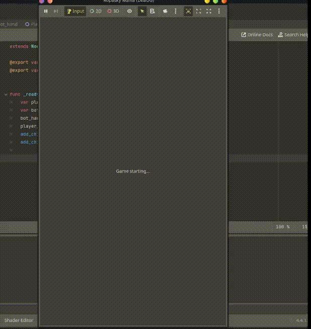

# 📘 Ropasky Mania – Develog

Welcome to the official development log for **Ropasky Mania** 
Here you’ll find all the updates, ideas, and behind-the-scenes changes as the game evolves.

---

## 🕹️ Move Overview (v0.1.0)

Each move can win, lose, or tie depending on logic, intuition, and thematic consistency:

**Summary**
| **Move**       | **Beats**                    | **Loses To**          | **Ties With**                                                 |
| -------------- | ---------------------------- | --------------------- | ------------------------------------------------------------- |
| **Rock**       | Fire, Scissors               | Water, Paper, Sword   | Rock, Shield                                                  |
| **Paper**      | Rock, Water, Shield          | Fire, Scissors, Sword | Paper                                                         |
| **Scissors**   | Paper, Shield                | Rock, Fire, Sword     | Scissors, Water                                               |
| **Fire**       | Paper, Shield, Scissors      | Rock, Water            | Fire, Sword                                                   |
| **Water**      | Fire, Rock, Sword            | Paper, Shield         | Water, Scissors                                               |
| **Sword**      | Scissors, Rock, Paper        | Water, Fire, Shield   | Sword                                                         |
| **Shield**     | Water, Sword                 | Fire, Paper, Scissors | Shield, Rock                                                  |
| **Corruption** |             -                |       -               | Rock, Paper, Scissors, Fire, Water, Sword, Shield, Corruption |

### 🔥 Fire  
- **Beats:** Paper, Shield, Scissors    
- **Loses to:** Rock, Water  
- **Ties with:** Fire, Sword  

### 💧 Water  
- **Beats:** Fire, Rock, Sword       
- **Loses to:** Shield, Paper  
- **Ties with:**  Water, Scissors  

### 🪨 Rock  
- **Beats:** Fire, Scissors  
- **Loses to:** Water, Paper, Sword  
- **Ties with:** Rock, Shield

### 📄 Paper  
- **Beats:** Rock, Water, Shield 
- **Loses to:** Fire, Scissors, Sword 
- **Ties with:** Paper  

### ✂️ Scissors  
- **Beats:** Paper, Shield  
- **Loses to:** Rock, Fire, Sword
- **Ties with:** Scissors, Water 

### 🗡️ Sword  
- **Beats:** Scissors, Rock, Paper  
- **Loses to:** Water, Fire, Shield  
- **Ties with:** Sword

### 🛡️ Shield  
- **Beats:** Water, Sword  
- **Loses to:** Fire, Paper, Scissors  
- **Ties with:** Shield, Rock 

### 🪙 Corruption (⚠️ Limited to 3 per player)
- Always results in a tie (neutralizes opponent's move)
- Represents bribery or "cheating"
- Strategic option to avoid loss or create suspense

---

## [0.1.0] - 2025-07-18

### Added
- Brainstormed the base gameplay concept for **Ropasky Mania**
- Created 7 core moves: Rock, Paper, Scissors, Fire, Water, Sword, Shield
- Introduced **Corruption** as a unique, limited-use strategic tie move
- Documented most move logic based on real-world intuition (e.g., water rusts sword, shield blocks water, fire melts paper)

### Notes
I quickly realized that giving the player access to all 8+ moves from the beginning was too much. 
It turned the game into a patternless guessing mess. So I’ve brainstormed difficulty levels that control the number of available moves:

### 🟢 Easy Mode (Classic – 3 Moves)  
**Moves:** Rock, Paper, Scissors  
This mode sticks to the original Rock-Paper-Scissors cycle, perfect for onboarding new players and quick matches.  
**Balance:** Classic circular dominance : Rock beats Scissors, Scissors beats Paper, Paper beats Rock.

---

### 🟡 Normal Mode (5 Moves – Elemental Twist)  
**Moves:** Rock, Paper, Scissors, Fire, Water  
Adds strategic depth with elemental moves while keeping the gameplay understandable.  
**Balance:** Mostly circular dominance with a thematic chain:  
Rock > Fire > Scissors > Paper > Water > Rock  

---

### 🔴 Hard Mode (Full Set – 8 Moves)  
**Moves:** Rock, Paper, Scissors, Fire, Water, Sword, Shield, Corruption  
For seasoned players craving complexity and tactical depth.  
**Balance:** Carefully balanced move relationships with 2-3 wins and losses per move, plus Corruption as a special tie move limited to 3 uses per player.

---

### 🟣 Total Balance Mode (Strict Circular Dominance)  
**Moves:** Rock, Paper, Scissors, Fire, Water, Sword, Shield  
This mode removes Corruption for pure circular dominance and a highly strategic experience.  
**Balance:** In that game mode, the player can only choose perfectly balanced moves:
 Each move beats exactly one other and loses to one other, forming a perfect loop: Rock > Shield > Sword > Water > Fire > Scissors > Paper > Rock

| Move    | Beats     | Loses To  | Ties With |
|---------|-----------|-----------|-----------|
| Rock    | Shield    | Paper     | Rock      |
| Shield  | Sword     | Rock      | Shield    |
| Sword   | Water     | Shield    | Sword     |
| Water   | Fire      | Sword     | Water     |
| Fire    | Scissors  | Water     | Fire      |
| Scissors| Paper     | Fire      | Scissors  |
| Paper   | Rock      | Scissors  | Paper     |

---
## [0.1.0] - 2025-07-26

### Added
- UI buttons from which the player choses a move
- Timer for the player to choose a move
- Determining winner logic

### Changed
- Better hand "reveal" animation

### Notes
The game is starting to look like something. Next time I'll be working 
on the UI (especially the hand) to give it more life. I also need to brainstorm the bot

## [0.1.0] - 2025-07-26

## Added
- Bot's hand
- wrote some part of bot logic

## Fixed
I rand into a lot of issue when I added the bot's hand:
	- It was replicating the move of the player
	- position issues
I completely deleted the main game scene and started from scratch

## Note
I know that I should've beed working on the UI, but I don't think it is urgent right now. 
I will write the code for the bot behaviour instead 
